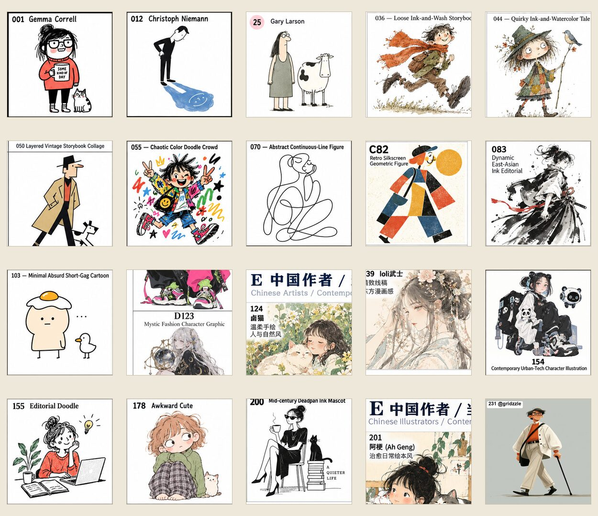

# gbot-handdraw

一个通过编号选择手绘风格的 Codex Skill，收录 `001–261` 共 261 种风格。

不会描述画风也没有关系：先在离线画廊中找到喜欢的编号，再告诉 Skill 你要表现的主题，即可生成适用于生图模型的中英文提示词；明确要求直接生图时，Skill 还会根据当前模型能力判断是否需要传入对应编号的参考图片。

## 它适合谁

- 不熟悉插画术语，但希望快速找到明确画风的创作者
- 制作公众号、小红书、短视频、海报或品牌内容的人
- 希望一组图片保持稳定视觉气质的内容团队
- 想浏览不同手绘方向，并用编号复用风格的人

## 它解决什么问题

“可爱一点”“文艺一点”“手绘感强一点”往往过于模糊，同一主题换一次模型，结果就可能完全不同；面对大量参考图时，也很难准确描述自己喜欢的是线条、构图、配色还是人物比例。

这个 Skill 把“凭感觉选图”整理成“编号 + 主题”的简单工作流。每个编号都对应一张单独的参考图片、风格名称、参考作者或来源，以及经过整理的核心视觉特征。

## 20 种风格预览

下面从 A–G 七个大分类中选取了 20 个编号。完整的 261 种风格请打开 [`gallery/index.html`](gallery/index.html) 浏览。



预览编号：`001`、`012`、`025`、`036`、`044`、`054`、`055`、`070`、`082`、`083`、`103`、`123`、`124`、`139`、`154`、`155`、`178`、`200`、`201`、`231`。

## 使用方法

1. 打开 [`gallery/index.html`](gallery/index.html)。
2. 按 A–G 分类浏览，或按编号、风格名称、参考名称搜索。
3. 记下喜欢的编号，或者点击卡片底部的“复制提示词”。
4. 填写主题并交给 Codex，例如：

```text
041号风格，主题：秋天的第一杯奶茶
```

也可以直接要求生成图片：

```text
请用 155 号风格，画一个深夜还在修改方案的设计师。
```

画廊卡片上方展示编号、风格名称和参考作者；提示词区域及复制内容只保留真正需要手工填写的两项：

```text
核心视觉特征：……
主题：[请填写]
```

## 参考图使用策略

Skill 默认负责生成中英文提示词。只有当用户明确要求生图时，才会解析当前模型和所选编号，决定是否需要使用风格参考图。

当前决策顺序是：

1. 优先使用风格名称与参考作者名称激活画风。
2. 名称不足时，在提示词中加入正向核心视觉特征。
3. 仍无法可靠激活，或该编号缺少足够文字特征时，传入对应编号的单图作为风格参考。

这样可以减少不必要的参考图约束，避免模型照搬示例图中的主体与构图。模型能力规则保存在 [`references/model_capabilities.json`](references/model_capabilities.json)，解析逻辑位于 [`scripts/resolve_reference.py`](scripts/resolve_reference.py)。

## A–G 风格分类

| 分类 | 编号 | 内容方向 |
| --- | --- | --- |
| A | 001–035 | 国际社论漫画 / 幽默手绘 |
| B | 036–054 | 国际绘本 / 叙事型手绘 |
| C | 055–082 | 现代平面 / 艺术化人物体系 |
| D | 083–123 | 日本作者 / 当代插画体系 |
| E | 124–154 | 中国作者 / 当代插画体系 |
| F | 155–200 | 通用网感 / 媒介 / 地域手绘 |
| G | 201–261 | 附件新增 / 当代插画补充 |

## 图片与目录结构

本版本只保留每个编号对应的一张 JPG 单图。离线画廊和生图参考共用这套文件，不再保存合集图或四宫格参考图。图片保持原始宽高，仅降低 JPEG 编码品质，以兼顾清晰度和仓库体积。

```text
gbot-handdraw/
├── SKILL.md
├── README.md
├── agents/
│   └── openai.yaml
├── assets/images/
│   ├── readme-preview-20.jpg
│   └── individual/
│       ├── 001-200/
│       └── 201-400/
├── gallery/
│   └── index.html
├── references/
│   ├── styles_200_reorganized.md
│   ├── styles.json
│   ├── attribution.json
│   └── model_capabilities.json
└── scripts/
    ├── build_library.py
    ├── prompt_style.py
    ├── resolve_reference.py
    ├── style_asset_paths.py
    └── validate_library.py
```

## 本版本的整理与改进

- 将原仓库分散在根目录的风格文档和图片整理为自包含 Skill。
- 移除固定磁盘路径和仓库外部依赖，统一使用 Skill 内相对路径。
- 移除重复的合集图和四宫格，只保留 261 张编号单图。
- 重新设计离线画廊，同时保留原来的 A–G 大分类。
- 在画廊中整合生图名称、参考名称和完整核心视觉特征。
- 将卡片提示词及复制内容简化为“核心视觉特征 + 主题”。
- 根据模型能力决定使用名称、文字特征或参考单图，避免无条件传图。
- 修复并简化资源解析、提示词生成和图库验证脚本。

## 原始出处与说明

本 Skill 的原始风格资料和图片来自 [yang0/handraw-style](https://github.com/yang0/handraw-style)。原项目提供了 001–261 风格编号体系、双语提示词思路和 A–G 分类，是本版本整理工作的基础。

本目录是在原项目基础上进行的结构整理、单图化、图片压缩、离线画廊重制和模型能力适配。参考作者与风格来源信息继续保存在 [`references/attribution.json`](references/attribution.json) 和 [`references/styles_200_reorganized.md`](references/styles_200_reorganized.md) 中。

原始仓库当前未提供明确的许可证文件。复用或再分发相关文字与图片前，请查看原项目的最新说明，并尊重原作者及素材来源。
