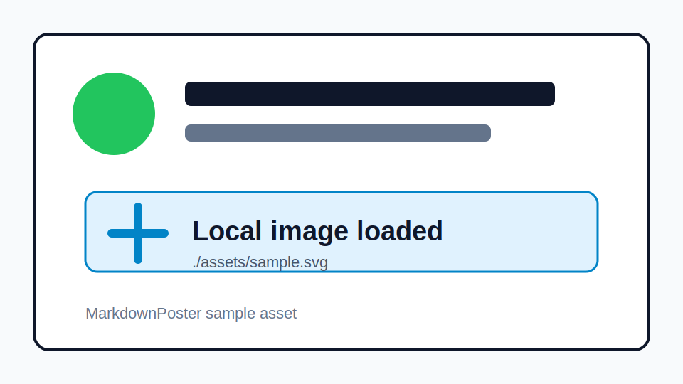

# MarkdownPoster Image Import Sample

This sample verifies that MarkdownPoster can import a Markdown directory with a
local image asset.

## Local Image

The image below is referenced with a relative path:



## Expected Result

When opened with the CLI, the Markdown content should appear in MarkdownPoster
and the image should render without any manual ZIP upload.

```bash
python3 scripts/mdp.py open references/sample-with-image
```
